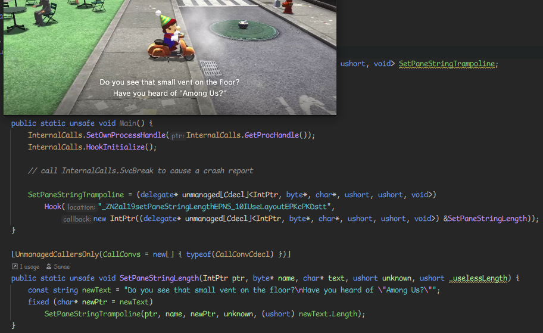

# Exlaunch.NET



An awful C# modding framework for Nintendo Switch games.
Uses .NET 6+ AOT compilation to compile C# assemblies to native code, and uses [exlaunch-cmake](https://github.com/Sanae6/exlaunch-cmake) for its runtime.

## Building

You need [.NET 6 **SDK**](https://dotnet.microsoft.com/en-us/download), [devkitARM](https://devkitpro.org/wiki/Getting_Started), `cmake`, and `git`.
If you are on Windows, you also need to run the following commands within MinGW or WSL.
For devkitARM, you should have the `DEVKITPRO` environment variable set and pointing to your installation. (example: `DEVKITPRO=/opt/devkitpro`) 

```shell
git clone https://github.com/Sanae6/Exlaunch.NET --recursive
cd Exlaunch.NET
bash build.sh
```

### Manual Building
If you want to build without using the build script, follow these commands.
```shell
# If you want to change Release to Debug, you can.
dotnet publish --sc -c Release -r linux-arm64 -o exlaunch-cmake/libs/
``` 

If you want to directly upload to your console (anonymous user) you can specify `FTP_IP`
and replace `YOUR_IP` with your console's IP address.
```shell
# Remove -DFTP_IP if you don't want to upload to console.
cmake -DCMAKE_TOOLCHAIN_FILE=cmake/toolchain.cmake -DFTP_IP=YOUR_IP -B build
```

Finally, you can run this command to build the project.
```shell
cmake --build build -t subsdk9_meta
```

## Credits

- @MichalStrehovsky - [zerosharp](https://github.com/MichalStrehovsky/zerosharp)
- @EngineLessCC - [exlaunch-cmake](https://github.com/EngineLessCC/exlaunch-cmake)
- @shadowninja108 - [exlaunch](https://github.com/shadowninja108/exlaunch/)
